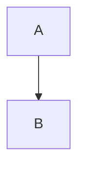
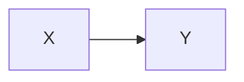

# Diagrams

```mermaid "A flow from A to B"
graph TD; A-->B
```

The same diagram again is rendered once:

```mermaid "A flow from A to B"
graph TD; A-->B
```

A diagram with alt text from its accessibility title:

```mermaid
graph LR
  accTitle: Left to right
  X-->Y
```
